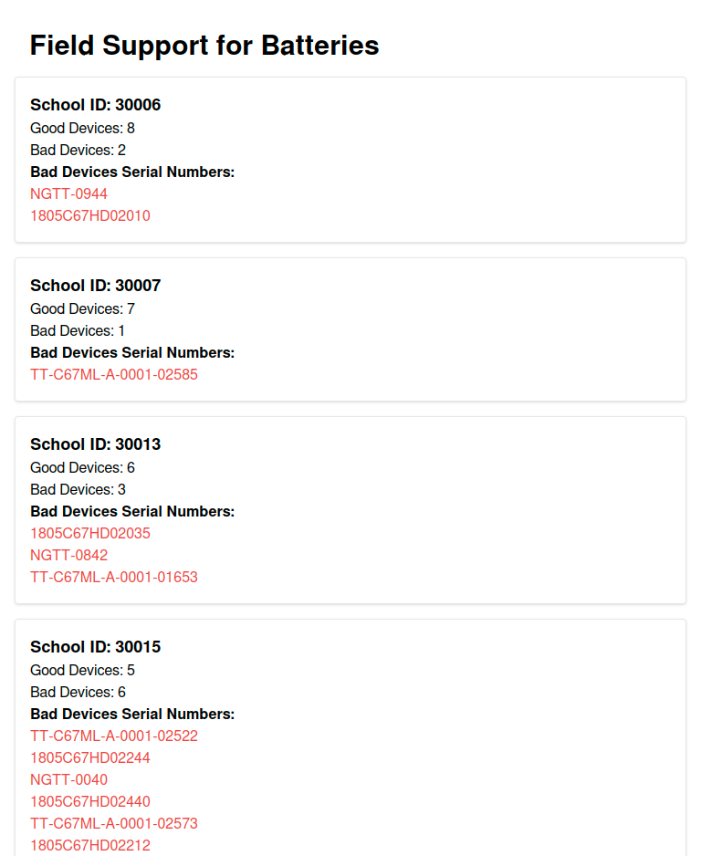

# Field Support for Batteries


A web application that identifies the schools with the highest number of battery issues,
so that the field team knows which schools to visit first

## Demo

 Deployed URL: - https://battery-checker-three.vercel.app/


## Tech Stack

**Client:** React, TailwindCSS, vite, vitest 


## Running Tests

To run tests, run the following command

```bash
  npm run test
```


## Run Locally

Clone the project

```bash
  git clone https://github.com/sridhar02/battery-checker
```

Go to the project directory

```bash
  cd battery-checker
```

Install dependencies

```bash
  npm install
```

Start the server

```bash
  npm run dev
```


## Screenshots




## Deployment

To deploy this project run

```bash
  npm run build
```


## Authors

- [sridhar02](https://www.github.com/sridhar02)

